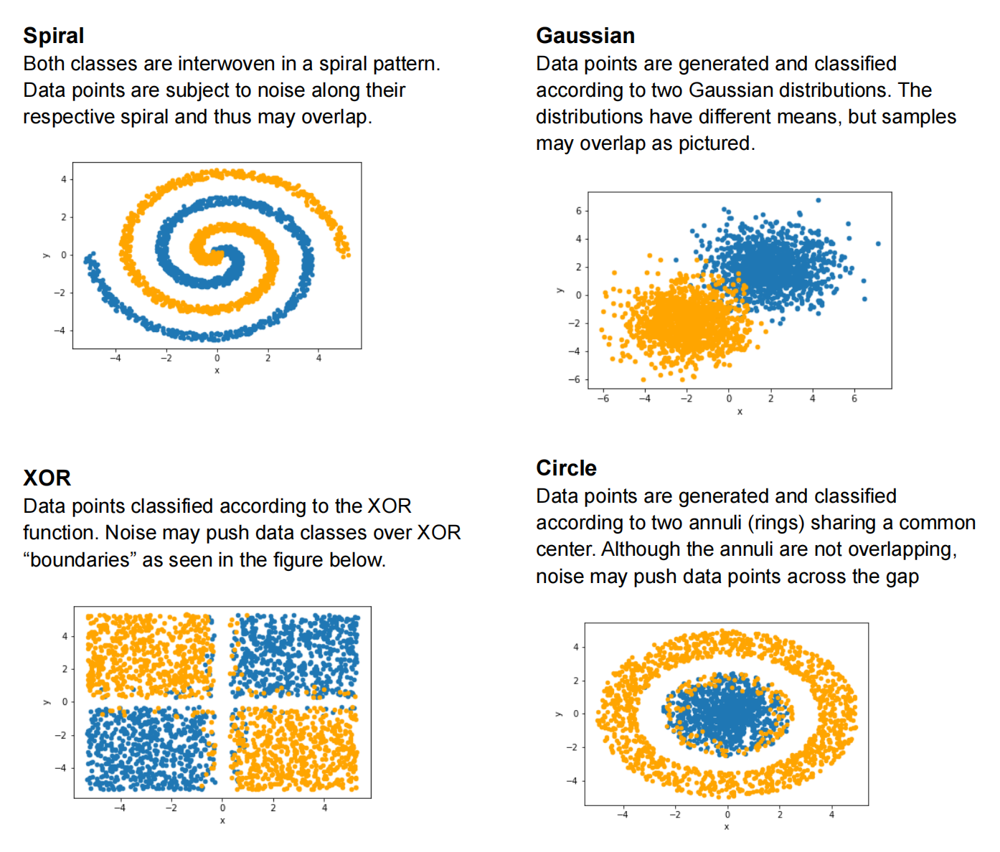
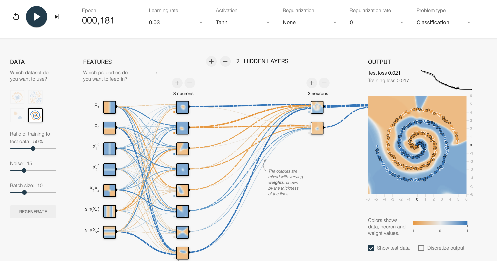

# MLP Data Classification
A data classification using MLP. 
<br>This is course assignment of USC CSCI561 - Foundations of Artificial Intelligence. Test environment is supported by Workbench. 

## Data Description
 https://playground.tensorflow.org
 <p align="center"></p>

## Run Program
```python
python3 NeuralNetwork3.py train_data.csv train_label.csv test_data.csv
```

## Model description
 <p align="center"></p>

# References
1. HW3_Description_latedate.pdf
2. http://www.adeveloperdiary.com/data-science/deep-learning/neural-network-with-softmax-in-python/
3. https://medium.com/@cmukesh8688/activation-functions-sigmoid-tanh-relu-leaky-relu-softmax-50d3778dcea5
4. https://machinelearningmastery.com/implement-backpropagation-algorithm-scratch-python/
5. https://cenleiding.github.io/神经网络ANN.html
